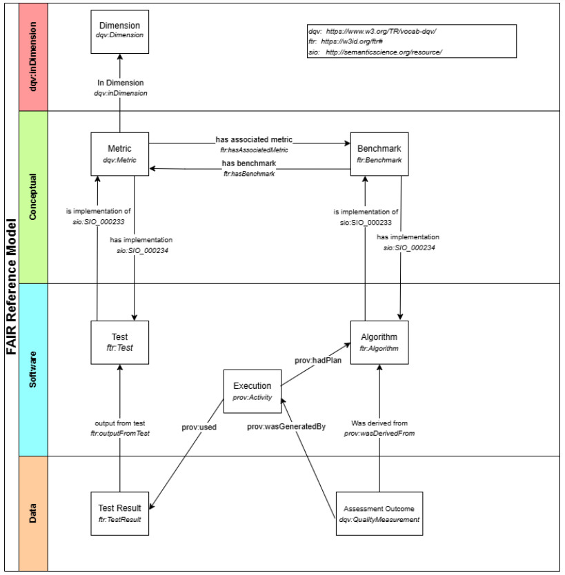

Architecture: FAIR-IF
=====================

The FAIR Testing Interoperability Framework (FAIR-IF) uses, almost exclusively, existing standards or extensions of standards, such as W3C Data Quality Vocabulary (https://www.w3.org/TR/vocab-dqv/), the W3C Data Catalog vocabulary (https://www.w3.org/TR/vocab-dcat-3/) and the W3C Provenance Ontology (https://www.w3.org/TR/prov-o/). These are employed to build the descriptors for the components that make up the FAIR Testing Reference Model and are described here. While most of these components contribute only indirectly to the Interoperability behaviour of the FAIR-IF, a brief discussion of all of them will simplify understanding how Interoperability is achieved.

FAIR Reference Model Conceptual Components
******************************************

Guided by the Compliance Assessment Toolkit [1], we have identified the set of distinct components that make up a FAIR testing environment.  These, and the relationships between them, are diagrammed in Figure 1. These are categorised as Conceptual (shown in green), Software (blue), and Data (orange) levels. In addition, there is a higher level of Conceptual object we call a Dimension (red), which represents an established principle (e.g. FAIR Principle F1) that motivates the need for the creation of a FAIR test (or set of tests).

Detailed definitions of these components are work in progress as we examine use-cases emerging from the participating Pilots, to ensure that the identified FAIRness Reference Model components are a) complete, and b) match the requirements of the FAIR-IF, and the overall expectations of the OSTrails IF. Briefly, here are the current definitions of the components.

The three Conceptual-level components involved in the FAIR Reference Model are:
    * Dimensions (using W3C Data Quality Vocabulary dqv:Dimension) - a high-level objective that should be met by digital objects corresponding to one of the FAIR Principles (e.g. R1.1. all digital objects should have a licence).
    * Metrics: Narrative description that a Test must wholly implement
    * Benchmarks: a narrative definition of how to interpret the Test Result Set resulting from the application of one or more Metrics to a digital object.

The two Software-level components in the FAIR Reference Model are:
    * Tests: A software object or defined manual workflow that examines some aspect of a digital object, and outputs a Test Result (i.e. pass/fail/indeterminate).
    * Algorithms: A piece of code or defined manual workflow that implements a Benchmark.

All these components (excluding Dimensions) have metadata descriptors following a formal model (see the FAIR Test Results formal specification https://w3id.org/ftr/).

The two data-level components are:
    * Test Result: The consequential output from a test. For the first iteration of the OSTrails FAIRness Reference Model, we will require that tests are very precise, and can have only “pass”, “fail”, or “indeterminate” as their possible outcomes. (This decision is subject to change based on experience with using the OSTrails IF). The output will include metadata (e.g. a progress log) that can be used to interpret the provenance behind the output.  Aggregations of Test Results are referred to as “Test Result Sets” and have a defined structure.
    * Assessment Outcome: The output from an Algorithm, representing the measurement of some Benchmark as a numeric or controlled vocabulary score.

The final component in the diagram, shown in black in the Figure above, is another software component – the “FAIR Assessment Tool” – that will exist, but its interface and behaviour are defined as part of the OSTrails Implementation Framework rather than the FAIR Reference Model.

To see the individual metadata descriptors of each of these components we refer the reader to the FAIR test results specification https://w3id.org/ftr/, which describes an OWL ontology, documentation and SHACL shapes to validate minimal test and metric metadata conformance.

An overview of the resources implementing different aspects of our framework maybe found in the "resources section" (https://docs.ostrails.eu/en/update-restructure/commons/resources.html#).

Additional information
**********************

Check our deliverables for more information:
    * [1] van Lieshout, N., Buys, M., Zamani, T., Rijsselberg, F., & Märkälä, A. (2024). Compliance Assessment Toolkit: Deliverable 2.2 (W. Hugo & W. Steinhoff, Eds.). Zenodo. https://doi.org/10.5281/zenodo.12683218
