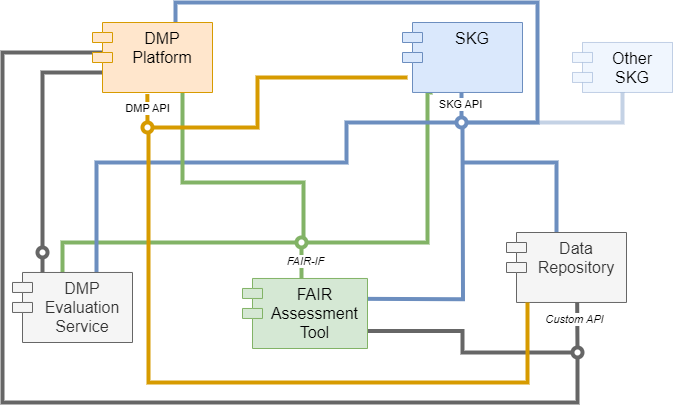

Architecture
============

.. page-authors::
    Tomasz Miksa

The OSTrails reference architecture provides guidance on realising interactions between key components identified in the OSTrails pathways: Data Management Plans (DMPs), Scientific Knowledge Graphs (SKGs), and FAIR Assessment. It clarifies which interactions are standardised within the Interoperability Frameworks and which are relevant to the project without prescribing specific implementation methods. For example, while the reference architecture specifies when the DMP API (part of the DMP Interoperability Framework) must be used, it leaves the method of accessing information from data repositories flexible.

A key objective of this architecture is to prevent vendor lock-in, ensuring tools and services can be used interchangeably in typical scenarios outlined by the pathways. For instance, any SKG conforming to the SKG-IF can seamlessly integrate with DMP tools to provide additional insights into reused datasets. This architecture emphasises harmonising the modelling and exchange of information across research data management services while allowing diverse implementation choices tailored to specific use cases.

The architecture also supports both current well-known and potential future patterns of interactions between components, fostering innovative use cases that enhance automation and machine-actionability of digital object information exchange. For example, while it is yet uncommon for data repositories to update DMPs, the architecture anticipates and accommodates such potential pathways.

    OSTrails Architecture

We use colour coding in the diagram:
    * Orange represents the components and communications that are subject to standardisation within the DMP-IF.
    * Blue represents the components and communications that are subject to standardisation within the SKG-IF.
    * Green represents the components and communications that are subject to standardisation within the FAIR-IF.
    * Gray represents the components and communications that are relevant for delivering the pathways identified by the project but are not subject to any of the interoperability frameworks, e.g. standards may already be in place, under development by other projects, or simply be based on custom interfaces provided by specific services.

The reference architecture consists of the following conceptual components:
    * DMP Platform – Platform, tool, or service (software system) for planning data management, producing data management plans (DMPs), including machine-actionable data management plans (maDMPs).
    * SKG - For the purposes of the OSTrails project, an SKG is defined as any database/repository with information pertaining to research products, processes and actors & agents which can present a graph-type view of this information via a suitable API.
    * FAIR Assessment Tool – Software that applies a set of FAIR Tests to the metadata/data of a digital object (such as datasets), presents the output as a FAIR Test Result Set, and provides assistance on how to interpret and improve the results.  FAIR Assessment tools may also include additional functionalities such as searching for and/or authoring Metrics and searching for and/or authoring Benchmarks.
    * DMP Evaluation Service - A service that takes a DMP as input and gives as a result measurements indicating if the DMP meets given compliance requirements. These requirements depend on the evaluation scenario but in general consist of measurements for subsets of information contained in a DMP. Such measurements can be the FAIRness of digital objects included in the DMP, compliance of the DMP with the RDA maDMP standard, or automated measurements of funder requirements such as the existence of relevant information and their allowed values. To provide these measurements, the DMP Evaluator coordinates the inclusion of the results of other evaluators and resolves information contained in a DMP through SKGs and other sources.
    * Data Repository – any service that stores and provides access to data. Usually, it provides a means for persistent identification and ensures that data is accompanied by metadata. Examples include zenodo.org, institutional repositories, etc.
    * Other SKG – same definition as for the SKG. This element is introduced in the reference architecture to indicate that the SKG-IF can be used for communication between different SKGs.

The reference architecture says that a *DMP Platform* must provide a DMP API that can be used by other services. SKGs and data repositories use this API to interact with the DMP Platform. The specific operations of the API will be described elsewhere. For the time being, one can imagine that a data repository can use the DMP API to e.g. add information about a specific licence assigned to a dataset described by the DMP.

The *SKGs* must provide an SKG API so that other SKGs can interact with them. DMP Platforms use SKG API to access information in SKGs, e.g. to search for datasets, or to fetch information using identifiers. DMP Evaluation Service and FAIR assessment tools use the SKG API to get additional information needed during assessment. Data repositories also use this API.

*FAIR Assessment Tools* have APIs that are only partially defined by the OSTrails reference architecture; that is, while the input required by a FAIR assessment tool cannot be predicted, the output structures from all FAIR assessment tools (namely, the “FAIR Test Result Set” data structure) have been specified by the FAIR Reference Architecture (Deliverable D1.2). Further discussion regarding this appears in the chapter 5 of this document. DMP Platforms, DMP Evaluation Services, and SKGs can thus expect a standardised response when interacting with FAIR assessment tools that comply with the FAIR-IF.

The *DMP Evaluation Service* provides an interface that the DMP Platform uses to interact with it, i.e. send maDMPs for evaluation and fetch the results. This interface will be designed as part of the DMP Evaluation Service and described in a separate deliverable. Yet, it will be specific to this service and does not belong to any of the interoperability frameworks, i.e. in case other similar services exist, they can define their own interfaces.

In a similar way, *Data Repositories* may have custom APIs that are used by FAIR Assessment tools or DMP Platforms. OSTrails does not attempt to standardise this communication because it is already a subject of the work by the EOSC Future project on standardising access to content via PID.

Additional information
**********************

Check our deliverables for more information:
    * Reichmann, S., Rey Mazón, M., Hasani-Mavriqi, I., Thaci, L., & Eckhard, D. (2024). **D1.1: Plan-Track-Assess Pathways**. Zenodo. https://doi.org/10.5281/zenodo.13145788
    * Miksa, T., Wilkinson, M., Manghi, P., & Suchánek, M. (2025). **D1.4 OSTrails Interoperability Reference Architecture V1**. Zenodo. https://doi.org/10.5281/zenodo.14795000
    * Suchánek, M., Martínková, J., Shepherdson, J., Miksa, T., Jirka, J., Knaisl, V., Moilanen, K., Sansone, S.-A., & Stavropoulos, T. (2025). **D2.5 OSTrails Commons Specifications**. Zenodo. https://doi.org/10.5281/zenodo.14795060

