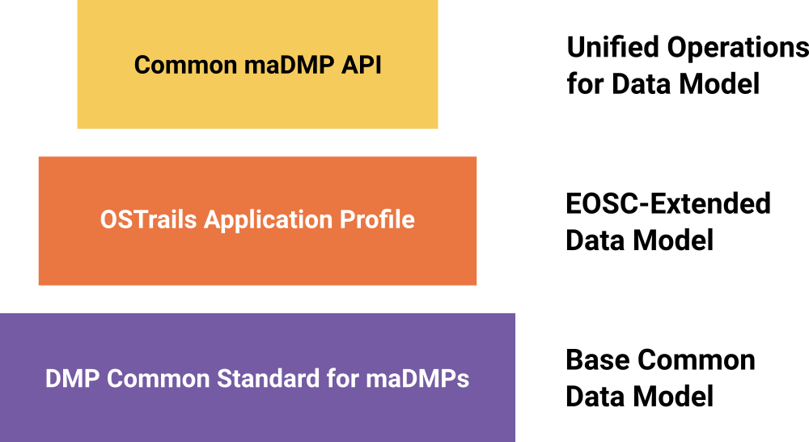

DMP Commons
===========

.. page-authors::
    Marek Suchánek
    Jana Martínková
    Tomasz Miksa

The **DMP Commons** provide a shared, reusable, and interoperable foundation for working with **machine-actionable Data Management Plans (maDMPs)** across tools and services to support the adoption of the **DMP Interoperability Framework**. They define how DMP information is structured, constrained, and exchanged, without prescribing how individual systems are internally designed or implemented. DMP Commons are primarily aimed at software developers building services that create or consume machine-actionable DMPs (maDMPs). This includes:

- DMP platform providers,
- Other services that integrate with these platforms, as outlined in our *Architecture and Pathways*.

In addition, DMP Commons are relevant for data stewards and other stakeholders who need to structure information about Research Data Management (RDM).

The Commons are built as a **layered framework** consisting of a common data model, an OSTrails (i.e. Europe/EOSC) -specific application profile, and a standard API. Together, these layers enable consistent interpretation of DMP content and predictable interactions between services, regardless of their internal architectures. This approach allows platforms to evolve independently while remaining interoperable at the boundaries. In addition, we provide :ref:`maDMP mappings <dmp-mappings>` to support the development of application profiles and to align DMP information with external standards and domain models.

    DMP Commons Layers

As illustrated above, the DMP Commons consist of three main components:

- :doc:`RDA DMP Common Standard for maDMPs <dmp-common-standard>`: The foundational data model defining core DMP concepts and structures in a machine-actionable way.
- :doc:`OSTrails Application Profile for maDMPs <application-profile>`: A Europe/EOSC-specific extension of the common standard that introduces additional entities, fields, and constraints to address regional interoperability needs.
- :doc:`OSTrails maDMP API Specification <madmp-api-specification>`: A standardised interface for programmatically interacting with maDMPs across platforms, built on top of the common standard and compatible with the application profile.

The primary users of the DMP Commons are **software developers, system architects, and service operators** who design or operate DMP platforms and related research data management services. Researchers are not expected to interact with the Commons directly; instead, they benefit indirectly through increased automation, reduced duplication of effort, and better reuse of DMP information across systems.

The DMP Commons are **community-driven and evolutionary** in a sense that they are designed to continuously evolve based on community feedback and emerging needs. They build heavily on work carried out in the Research Data Alliance (RDA), including the RDA DMP Common Standard recommendation, and in turn actively contribute back to those communities. The framework is designed to support gradual adoption, while enabling full interoperability when all components are implemented.

----

For the time being, the Commons consist of the following resources:

.. toctree::
    :caption: DMP Commons Resources
    :maxdepth: 1
    :titlesonly:

    DMP Common Standard for maDMPs <dmp-common-standard>
    OSTrails Application Profile for maDMPs <application-profile>
    OSTrails maDMP API Specification <madmp-api-specification>
    maDMP mappings <mappings/index>
    DMP Evaluation Metrics <dmp-evaluation-metrics>
    DMP Catalogue of Tests <dmp-catalogue-of-tests>
