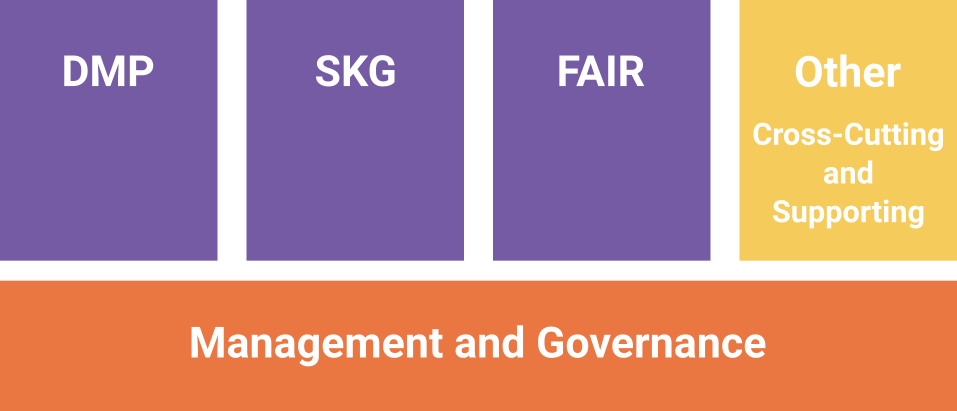
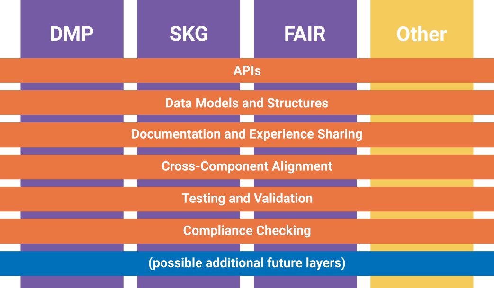

OSTrails Commons: Governance
============================

.. page-authors::
    Marek Suchánek

The OSTrails Commons is a structured collection of open, reusable specifications designed to facilitate interoperability within the OSTrails ecosystem. Its governance ensures sustainable management, adoption, and evolution. The governance framework incorporates structured leadership, participation policies, and sustainability strategies aligned with global best practices, including the Global Open Research Commons (GORC). Please note, that this is **early-stage** governance structure for OSTrails Commons and it may change as the Commons are being materialised over the course of the project.

.. _commons-structure:

Commons Components and Layers
-----------------------------

The Commons is organised into five components, ensuring comprehensive coverage of all included resources. Every resource, whether directly supporting interoperability or serving as foundational infrastructure, is categorised within this structure. This framework encompasses the core Plan-Track-Access framework-related elements, supporting tools, and essential management resources to maintain and evolve the Commons effectively.

    Components of OSTrails Commons

Furthermore, the Commons is organised into a layered structure that complements the core components (DMP, SKG, FAIR) and supporting tools. This approach ensures a systematic, modular framework where resources are categorised not only by their functional area but also by the type of technical or conceptual contribution they make. The layering enables consistency across components, promotes reusability, and supports the alignment of tools with the Interoperability Framework.

Each layer reflects a distinct aspect of resource organisation, whether it involves APIs for tool integration, data models for structured information exchange, or compliance mechanisms for evaluating adherence to the framework. This structure is designed to D2.5 OSTrails Commons Specification remain extensible, allowing new layers to be introduced as needs evolve, especially in response to extensions or updates in the Interoperability Framework. Unlike the introduction of new components, which are tied to the PTA framework and thus less likely, additional layers may be necessary to address emerging interoperability requirements or technological advancements.

    Layers and Components of OSTrails Commons

Governance Structure
--------------------

OSTrails Commons is managed through a federated governance model, ensuring adaptability and inclusivity. The governance structure consists of:

- **Group of Maintainers**: Responsible for specific parts of the Commons, ensuring technical consistency, version control, and interoperability standards across components (DMP, SKG, FAIR).
- **Resource Representatives**: Responsible for specific resource(s) that are part of the Commons, maintaining its record up-to-date and the resource aligned with the Commons and OSTrails Interoperability Framework.
- **Community Contributors**: Researchers, developers, and stakeholders who provide feedback, propose enhancements, and contribute to resource maintenance.

Maintenance and Evolution
-------------------------

The Commons evolves through structured updates and community contributions. Maintenance follows these principles:

- **Versioning Policy**: Updates follow semantic versioning, ensuring compatibility and traceability.
- **Compliance Monitoring**: Resources are periodically assessed against interoperability standards (EOSC, GORC).
- **Feedback Mechanism**: Contributions and issues are managed via GitHub discussions and issue tracking.
- **Deprecation & Archival**: Outdated resources are phased out following transparent guidelines to maintain usability and relevance.

GORC Alignment
--------------

As part of the OSTrails Commons Specification, the Global Open Research Commons (GORC) International Model has been utilized, ensuring:

- **Sustainability**: Long-term stewardship of resources and metadata.
- **Interoperability**: Adherence to global data exchange and research infrastructure standards.
- **Transparency & Engagement**: Open decision-making processes, public documentation, and structured community involvement.
