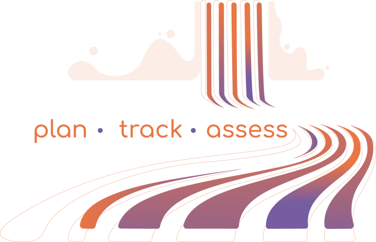

OSTrails Documentation
======================

Welcome to the technical documentation for OSTrails, the Open Science Plan-Track-Assess Pathways project.

Documentation Structure
-----------------------

*This documentation is currently under development...*

.. toctree::
    :maxdepth: 2
    :caption: Other

    other/vocabulary
    other/contributing
    other/resources
    other/contributors
