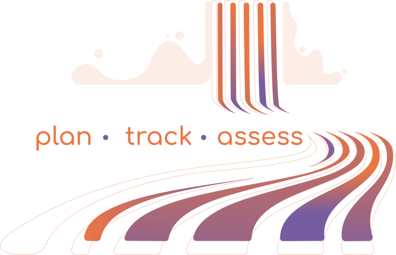

OSTrails Documentation
======================

Welcome to the technical documentation for OSTrails, the Open Science Plan-Track-Assess Pathways project.

Documentation Structure
-----------------------

The documentation is structured as follows:

.. toctree::
    :maxdepth: 4
    :caption: Architecture

    Introduction <architecture/intro>
    DMP IF <architecture/dmp-if>
    SKG IF <architecture/skg-if>
    FAIR IF <architecture/fair-if>

.. toctree::
    :maxdepth: 4
    :caption: Commons

    Introduction <commons/intro>
    Governance <commons/governance>
    DMP Commons <commons/dmp/dmp-commons.rst>
    SKG Commons <commons/skg/skg-commons.rst>
    FAIR Commons <commons/fair/fair-commons.rst>

.. toctree::
    :maxdepth: 4
    :caption: Toolbox of Testing Services

    General Documentation <tools/toolbox>

.. toctree::
    :maxdepth: 4
    :caption: Other

    other/vocabulary
    other/contributing
    other/resources
    other/contributors
