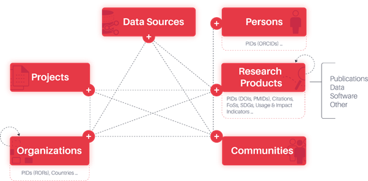

.. _tool-apis:

APIs
====

APIs that implement, expose, or interoperate with the SKG-IF data model and OpenAPI specification.

.. raw:: html

    An ongoing, up-to-date list of SKG API-implementing tools is available at <a href='https://skg-if.github.io/api/docs/api-implementors.html'>SKG-IF API Tools</a>.

.. contents:: On this page
    :local:
    :depth: 2

.. _tool-cessda-api:

CESSDA SKG-IF API
-----------------------

Overview
~~~~~~~~

For links to OpenAPI documentation, implemented endpoints, and examples of filter usage, see
`skg-if-staging.cessda.eu <https://skg-if-staging.cessda.eu/>`_.

Endpoints
~~~~~~~~~

    * `https://skg-if-staging.cessda.eu/products <https://skg-if-staging.cessda.eu/products>`_ – Returns studies from the CESSDA Data Catalogue (CDC).
    * `https://skg-if-staging.cessda.eu/topics <https://skg-if-staging.cessda.eu/topics>`_ – Returns topics from the European Language Social Science Thesaurus (ELSST).

Current Status
~~~~~~~~~~~~~~

Version 0.1.0 has been released, with minor fixes since then. The Products endpoint may respond slowly but should return all CDC studies without errors.

.. note::

    This is a staging environment intended for testing. Availability is not guaranteed, and services may be
    down without prior notice. Endpoints, data, and behavior are subject to change at any time.

.. _tool-openaire-graph-api:

OpenAIRE Graph API
--------------------

The `OpenAIRE Graph <http://graph.openaire.eu>`_ is a scholarly knowledge graph designed to provide a
comprehensive view of scholarly communication and research outputs at the global level. It integrates data
from various sources, including publications, research datasets, projects, and authors, creating a cohesive
representation of scholarly information.

Data Model
~~~~~~~~~~

The OpenAIRE Graph employs a comprehensive data model that encapsulates a diverse range of entities essential
to scholarly communication. Key entities include:

- Publications: scholarly articles, conference papers, and other forms of research outputs.
- Research Data: datasets and other research data associated with various scholarly works.
- Research Software: tools and applications developed for research purposes.
- Authors: individual researchers and their institutional affiliations.
- Funders and Projects: funded research initiatives and their resultant outputs.
- Organizations: institutions, companies, and funding bodies contributing to research and its development.

The graph not only represents these entities but also illustrates the relationships between them. This
interconnectedness allows users to explore citations, collaborations, project affiliations, and software
dependencies among a vast network of research products.

    SKG OpenAIRE Graph

Content
~~~~~~~

The OpenAIRE Graph populates its content by harvesting from more than 2000 trusted data sources native to
scholarly communication, including:

- Crossref and DOAJ: for scholarly publisher metadata and citations.
- DataCite: for research data, software, and publication metadata and citations.
- OpenCitations: for citation data.
- ORCID: linking researchers to their work and contributions.
- Institutional repositories and CRIS systems worldwide: for research data, software, and publication metadata and citations.
- ROR (Research Organization Registry): standardizing organization identifiers and author-organization-research product affiliations.
- arXiv, PubMed, DBLP, RePEc, and others: covering scientific papers in specific disciplines.
- Additionally, it includes hundreds of data and software repositories sourced from research infrastructures, science clusters, and the broader European Open Science Cloud (EOSC) domain.

Today, the Graph boasts the largest collection of research products and citations, facilitating discovery,
browsing, and in-depth bibliometric analysis of how knowledge and findings are shared and built upon within
the scholarly community.

To learn more about how it is built and how to access the data, refer to https://graph.openaire.eu/docs/.

Implementation of the SKG-IF APIs
~~~~~~~~~~~~~~~~~~~~~~~~~~~~~~~~~~

The OpenAIRE Graph APIs are accessible from https://graph.openaire.eu/docs/apis/home. The set of APIs is
being extended with the implementation of the Scholarly Knowledge Graph Interoperability Framework (SKG-IF)
APIs, to further enhance the accessibility and usability of the OpenAIRE Graph.

    - **Swagger API**: https://api.openaire.eu/graph/v3/api-docs/SKG-IF%20OpenAPI%20V1
    - **Endpoints**:

      - ``/skg-if/v1/products`` – returns products matching criteria.
      - ``/skg-if/v1/products/{local identifier}`` – returns the product record with the given ``{local identifier}``.

    - **Current status**: Version 1.0.0 has been released as an initial draft, with the intent to extend to other endpoints serving the remaining entities.

.. _tool-rohub-api:

ROHub API
------------

.. page-authors::
    Raul Palma

`ROHub <https://www.rohub.org/>`_ is an RO-Crate management platform that provides a holistic solution for
the storage, lifecycle management, and preservation of scientific investigations, campaigns, and operational
processes via research objects. It makes these resources available to others, allows them to be published
and released through a DOI, and supports the discovery and reuse of pre-existing scientific knowledge.
ROHub implements the RO-Crate specification and uses it as the standard format for serialising and exchanging
research objects. ROHub provides the backbone to a wealth of RO-centric applications and interfaces across
different scientific communities. It is available via a public instance, and can also be provided as a
dedicated/private instance (Platform as a Service) or on-premises.

Architecture Overview and Integrations
~~~~~~~~~~~~~~~~~~~~~~~~~~~~~~~~~~~~~~~~

ROHub comprises a backend component, an IAM component, (meta-)data and resource storage components, and a
set of user interfaces. The backend exposes a comprehensive REST API, which can be used by different
applications. The user interfaces include a reference web portal and a Python library. The ROHub portal
provides a comprehensive user interface for the management and preservation of research objects, while the
Python library works on top of the ROHub backend REST API, wrapping and abstracting the REST methods in
user-friendly API methods that can be used, for instance, via Jupyter notebooks. Additionally, various
external services are integrated into or leveraged by ROHub, including RO added-value services as well as
various EOSC services.

These include:

- **Semantic enrichment and recommendation**, plus a set of extended analytic services. The former generates structured, machine-readable metadata about the content of a research object, including the main concepts and phrases, the entities and their type, and topical information from domains according to the Expert.ai linguistic knowledge graph, and generates recommendations based on the discovered metadata. The latter includes the challenge and solution extraction, the question generation service, the claim analysis service, and the novelty scoring service.
- **Checklist service**: provides access to the minim-based checklist evaluation of research objects, used to assess their quality for different purposes, e.g. completeness, accessibility, or readiness for release, according to the needs of a particular community or application.
- **Quality monitoring service**: enables the evaluation of the RO through time by capturing discrete values provided by the checklist service at different moments of its evolution.
- **FAIROS service**: measures the FAIRness of Research Objects by calculating the FAIRness of individual aggregated resources, including the Research Object itself, and then aggregating those results to calculate the overall FAIR score.
- **EGI Check-in**: the EOSC Identity and Access Management (IAM) service that connects federated Identity Providers (IdPs) with EOSC service providers.
- **Zenodo**: ROHub allows RO-Crates to be released and shared via Zenodo.
- **B2SHARE**: ROHub allows RO-Crates to be released and shared via B2SHARE.
- **B2DROP**: ROHub users can use the default ROHub storage, or B2DROP, as their personal storage space for resources uploaded to their research objects. B2DROP resources are synchronized with the corresponding research objects in both directions.
- **Notebooks**: ROHub users can open and load Jupyter notebooks from the ROs automatically in EGI Notebooks directly from ROHub, and execute their methods/processing in an interactive computing environment (reproducible science).
- **Replay**: ROHub users can open and load Jupyter notebooks automatically and reproduce their associated computing environment with Replay, including any related input datasets, directly from the ROs in ROHub (highly reproducible science).
- **OpenAIRE/EOSC Research Graph**: ROHub resources, particularly ROs, Jupyter notebooks, and data cubes, are harvested into the graph, making them findable directly from the EOSC Marketplace.
- **Argos**: ROHub enables the creation of ROs from DMPs in Argos, leveraging and representing all the DMP information in machine-readable format, enabling researchers to turn their DMP into a machine-actionable DMP connected with the datasets themselves.
- **ADAM**: ROHub enables the aggregation of data cubes from ADAM by reference, leveraging all the metadata available in ADAM to describe them in the RO. ROHub users can open and load data cubes in ADAM directly from ROHub for their usage and exploration.

Authentication and Authorization
~~~~~~~~~~~~~~~~~~~~~~~~~~~~~~~~~~

The ROHub Identity and Access Management (IAM) is based on Keycloak technology. It allows users to
authenticate to ROHub and enables single sign-on across various other services. The most important feature
of ROHub IAM is that it is integrated with EGI Check-in AAI and with Pionier.ID. The former allows users to
authenticate through the EGI Check-in service, which operates as a central hub connecting federated Identity
Providers (IdPs) with EOSC service providers. The latter allows access to the services of the PIONIER
Consortium for Polish science and automatic membership in eduGAIN, which connects identity federations
around the world, simplifying access to content, services, and resources for the global research and
education community.

SKG-IF Implementation
~~~~~~~~~~~~~~~~~~~~~~

An initial implementation (under testing) of OSTrails SKG-IF exposes RO-Crates as Scientific Knowledge
Graphs, focused on research products. This required specifying and implementing the mapping of RO-Crate
metadata to the SKG-IF data model. This will allow the integration and/or harvesting of RO-Crate metadata by
other SKGs that use this API for harvesting, such as OpenAIRE, which plans to use such an API in the future.
Currently, the OpenAIRE SKG harvests metadata about RO-Crates (and other key resources) from ROHub via its
OAI-PMH endpoint.

Resources and Identifiers
~~~~~~~~~~~~~~~~~~~~~~~~~~

Portal
^^^^^^^

    - **Portal**: https://www.rohub.org/
    - **re3data.org persistent identifier**: http://doi.org/10.17616/R31NJN60
    - **FAIRsharing identifier**: https://fairsharing.org/4119
    - **Portal documentation**: https://reliance-eosc.github.io/rohub-portal-documentation/
    - **Version**: 4.0.2

API
^^^^

    - **API**: https://api.rohub.org/api/
    - **OpenAPI**: https://api.rohub.org/api/swagger/
    - **Redoc**: https://api.rohub.org/api/redoc/
    - **OAI-PMH endpoint**: https://api.rohub.org/api/oai2d/
    - **SPARQL endpoint**: https://rohub2020-api-virtuoso-route-rohub2020.apps.paas.psnc.pl/sparql/
    - **Version**: 2.1.81

Python Library
^^^^^^^^^^^^^^^

    - **Python library**: https://reliance-eosc.github.io/ROHUB-API_documentation/html/README.html
    - **API library documentation**: https://reliance-eosc.github.io/ROHUB-API_documentation/html/index.html
    - **API library example Jupyter notebooks**: https://github.com/RELIANCE-EOSC/sample-notebooks
    - **Repository**: https://github.com/oeg-upm/FAIR-Research-Object
    - **License**: MIT

Support
^^^^^^^^

    - **ROHub in EOSC**: https://open-science-cloud.ec.europa.eu/resources/datasources/21.11166%2FBA1Ba2
    - **Tutorial**: https://reliance-eosc.github.io/ROHUB-API_documentation/html/tutorials.html
    - **Training materials**: https://www.reliance-project.eu/adopters/
    - **Helpdesk**: https://support.pcss.pl/servicedesk/customer/portal/27
    - **Support email**: support@rohub.org
